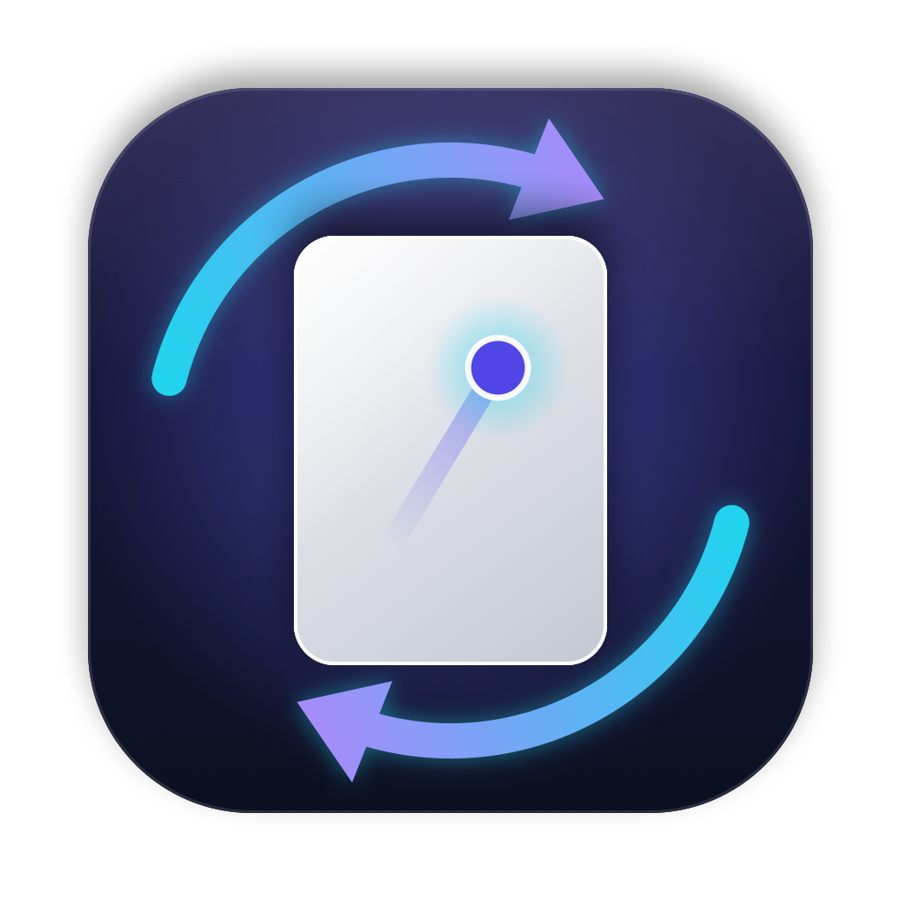
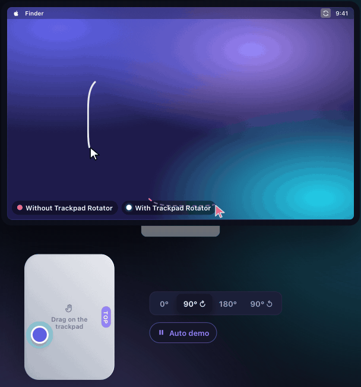
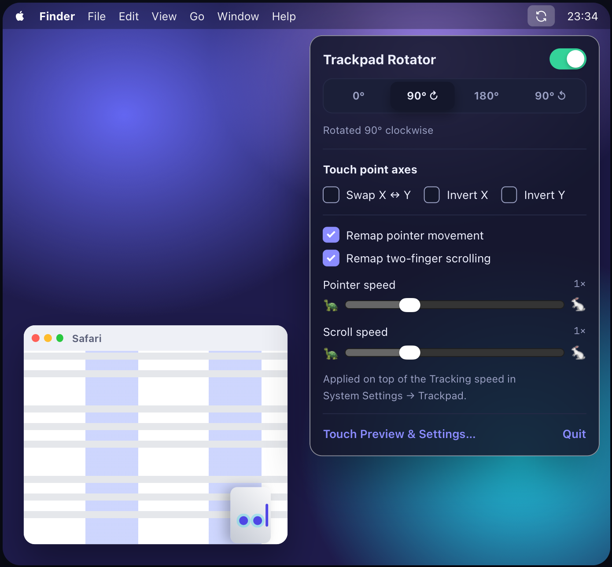
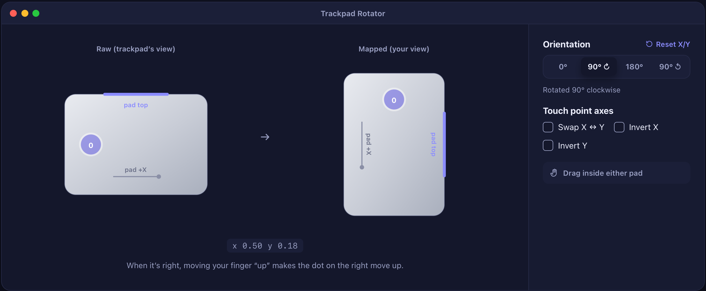
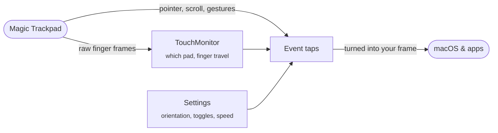

<div align="center">



# Trackpad Rotator

**Turn the trackpad. Keep your gestures.**

Use a Magic Trackpad turned 90°, 180° or 270°, and the pointer, scrolling and swipes still follow your fingers.<br>
A native macOS menu bar app, built with SwiftUI.

[](https://github.com/lazycatlabs/trackpad_rotator/releases/latest)


[**Download for Mac**](https://github.com/lazycatlabs/trackpad_rotator/releases/latest) · [Features](#features) · [Install](#install) · [Permissions](#permissions) · [How it works](#how-it-works) · [FAQ](#faq) · [Development](#development)

<br>



<sub>Trackpad turned 90°: the pink pointer is what macOS does on its own, the white one is with Trackpad Rotator.</sub>

</div>

## Features

**Every gesture, in your frame, not the trackpad's.**



| | |
| --- | --- |
| 🖱️ **Pointer** | Move your finger "up" and the cursor goes up, whichever way the pad is turned. Distance still follows macOS's own tracking speed, times an optional multiplier. |
| 📜 **Two-finger scroll** | Scrolling follows your fingers too, including momentum, and respects Natural scrolling. |
| ↔️ **Swipe between pages** | Sideways swipes go back and forward in Safari, Finder and other apps. |
| 🔔 **Notification Center** | Two fingers left from *your* right edge open Notification Center. |
| 🪟 **Three- and four-finger swipes** | Mission Control, App Exposé and switching Spaces are turned to match. What each one does is still up to System Settings → Trackpad. |
| 🎯 **Only the trackpad** | External Magic Trackpads only by default, or all trackpads. A mouse is never touched. |

<br clear="right">

The **Touch Preview** window shows your fingers twice: as the trackpad reports them and after your orientation. When the right side moves the way your hand does, you're set. Swap X/Y and invert either axis for unusual setups.

<p align="center">
  
</p>

> [!TIP]
> Every remap (pointer, scroll, page swipes, Notification Center, three/four-finger swipes) has its own toggle in the menu bar panel, plus speed sliders for pointer and scroll.

## Install

Requires macOS 14 Sonoma or later.

**Homebrew**

```bash
brew install --cask lazycatlabs/tap/trackpad-rotator
```

**Or download the zip** from [Releases](https://github.com/lazycatlabs/trackpad_rotator/releases/latest), unzip it and drag **Trackpad Rotator** to Applications.

> [!NOTE]
> **First launch.** Trackpad Rotator isn't notarized yet, so macOS blocks it the first time:
>
> 1. Open Trackpad Rotator.
> 2. Go to **System Settings → Privacy & Security**.
> 3. Click **Open Anyway**, once.

When the app runs from `/Applications` for the first time, it turns on **Launch at login**. You can turn that off in the settings window.

<details>
<summary><b>Build from source</b></summary>

**With Xcode**

```bash
open TrackpadRotator.xcodeproj
```

Choose the **TrackpadRotator** scheme and press **⌘R**. To install, use **Product → Archive → Distribute App → Copy App**, and put the app in `/Applications`.

**Or from the command line** (no Xcode project needed)

```bash
./build.sh
```

```bash
cp -R "build/Trackpad Rotator.app" /Applications/
```

</details>

## Permissions

Trackpad Rotator needs two permissions. Grant them on first launch:

| Permission | Why |
| --- | --- |
| **Accessibility** | Move the pointer and rewrite scroll and gesture events |
| **Input Monitoring** | Read raw finger data from the trackpad |

The **Permissions** section, in both the menu bar panel and the settings window, shows whether each one is granted and has a **Request** button.

> [!NOTE]
> macOS shows each permission prompt only once. After that, **Request** opens the right pane in **System Settings → Privacy & Security**.

> [!IMPORTANT]
> Permissions are tied to the code signature. Build with the same signing identity every time, or macOS forgets the grants after each rebuild.

## How it works



1. `MultitouchSupport.framework` streams raw finger frames, so the app knows which trackpad is touched and which way your fingers moved.
2. Event taps catch the pointer, scroll and gesture events macOS makes from the trackpad.
3. Each event's direction is replaced with the finger travel turned by your orientation, then it is passed on.

<details>
<summary><b>Each gesture in detail</b></summary>

- **Pointer** (HID-level tap): direction comes from finger travel turned by the orientation; distance comes from macOS's own delta × the pointer speed. While the trackpad is touched, the cursor is detached from the hardware (`CGAssociateMouseAndMouseCursorPosition`) and placed with `CGWarpMouseCursorPosition`.
- **Scroll** (session-level tap): the same direction approach, with momentum keeping the last direction and Natural scrolling respected.
- **Swipe between pages**: AppKit decides on more than the scroll deltas, so the tap also turns the undocumented raw deltas, the companion gesture events, the `IOHIDEvent` attached to each event (via private SkyLight/IOKit calls) and the finger positions in the touch events.
- **Notification Center** (`EdgeSwipe.swift`): macOS looks for its edge swipe on the pad's own right edge, so the app recognises "two fingers left from your right edge" itself, opens Notification Center through its accessibility action and drops that scroll.
- **Three- and four-finger swipes** (`DockSwipe.swift`, HID-level tap): macOS recognises them on the pad's own axes and sends the Dock a "dock swipe" event with an axis and a progress. The tap turns those (and the attached `IOHIDEvent`, which is what the Dock acts on) into your frame. What each swipe does is still decided by System Settings → Trackpad → More Gestures.

</details>

## Limitations

- Pinch and rotate aren't touched; they don't depend on orientation.
- macOS still opens Notification Center from the pad's own right edge, wherever that edge now is.

> [!WARNING]
> The app relies on private frameworks and undocumented event fields, which may change in future macOS releases. If they do, swipe between pages and the three/four-finger swipes are the first things to stop working.

## FAQ

<details>
<summary><b>Does it work with the MacBook's built-in trackpad?</b></summary>

Yes. In the settings window, under **Apply to**, choose **All trackpads (incl. built-in)**. The default is external trackpads only.

</details>

<details>
<summary><b>The pointer goes the wrong way. What do I do?</b></summary>

Open **Touch Preview & Settings…** from the menu bar, put a finger on the trackpad and pick the orientation that makes the dot on the right move the way your finger does. If it's still off, use **Swap X ↔ Y** or **Invert X/Y**, or **Reset X/Y** to start over.

</details>

<details>
<summary><b>It stopped working after I rebuilt the app.</b></summary>

macOS ties permissions to the code signature. Rebuild with the same signing identity, or remove Trackpad Rotator from **Accessibility** and **Input Monitoring** in System Settings and grant it again.

</details>

<details>
<summary><b>Does it collect any data?</b></summary>

No. There's no network access, no analytics and no accounts. Finger data is only used in memory to remap events.

</details>

## Development

You'll need Xcode 16 or later. The app is built in the Swift 6 language mode with strict concurrency, and the project uses synchronized folders, so new files in `Sources/` are picked up automatically.

```bash
git clone https://github.com/lazycatlabs/trackpad_rotator.git
```

```bash
cd trackpad_rotator && open TrackpadRotator.xcodeproj
```

Or build without opening Xcode:

```bash
xcodebuild -project TrackpadRotator.xcodeproj -scheme TrackpadRotator build
```

<details>
<summary><b>Signing</b></summary>

- **Xcode**: the target uses automatic signing with the project owner's team. Contributors should pick their own team under *Signing & Capabilities*.
- **`build.sh`**: signs with the first "Apple Development: Mudassir" identity. Set `SIGN_IDENTITY` to use another one; without an identity it falls back to ad-hoc signing, which loses permissions on every rebuild.

</details>

<details>
<summary><b>Project layout</b></summary>

The UI is SwiftUI with MVVM: **Views → ViewModels → Repositories → Engine**. Views never call the engine or system APIs directly. ViewModels are `@MainActor @Observable` classes, passed down with `.environment(_:)`.

```
Sources/
  App.swift              @main: menu bar extra and settings window
  Models/                AxisTransform (rotation + swap/invert) and EngineConfig
  Repositories/
    SettingsRepository   UserDefaults, launch at login, the config snapshot the engine reads
    PermissionsRepository  Accessibility / Input Monitoring checks, prompts, Settings links
    TrackpadRepository   The UI's only entry point into the engine
  ViewModels/            StatusViewModel (permissions, tap, devices) and SettingsViewModel
  Views/                 Menu bar panel, settings window, touch preview, shared controls
  Engine/
    MTBridge.c           Loads the private MultitouchSupport.framework with dlopen
    TouchMonitor.swift   Which device is touched, finger centroid travel (mm)
    EventTap.swift       Pointer, scroll and page-swipe remapping
    EdgeSwipe.swift      Notification Center swipe
    DockSwipe.swift      Three- and four-finger swipes
    HIDEvent.swift       Reads and rewrites the IOHIDEvent attached to a CGEvent
TrackpadRotator.xcodeproj  Xcode project
build.sh                 swiftc build, no Xcode project needed
Scripts/                 App icon generator
docs/                    README images, captured from the landing page
```

</details>

<details>
<summary><b>Diagnostics</b></summary>

Logs go to the `lazycatlabs.trackpadrotator` subsystem:

```bash
/usr/bin/log show --last 5m --predicate 'subsystem == "lazycatlabs.trackpadrotator"'
```

Use the full path in zsh, where `log` is a shell builtin. A per-gesture scroll summary is logged at debug level; add `--debug` to see it.

</details>

<details>
<summary><b>App icon</b></summary>

```bash
./Scripts/make-icon.sh
```

Writes `Resources/AppIcon.icns` and `Resources/AppIcon-1024.png`. `build.sh` runs it automatically when the `.icns` is missing.

</details>

The landing page lives in a separate project (`~/Workspace/Web/trackpadrotator.lazycatlabs`).
